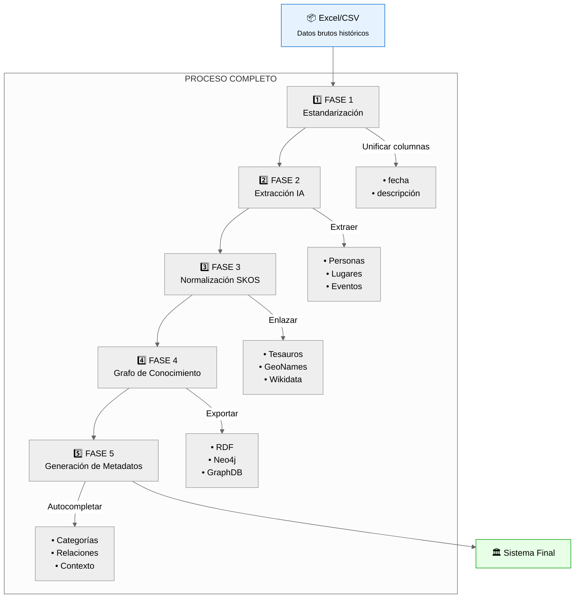

# Sistema para Generación de Metadatos en Documentos Históricos

## Objetivo General

Construir un sistema que genere metadatos estructurados e interoperables a partir de catálogos históricos, utilizando estandarización, extracción con modelos de lenguaje, normalización semántica y construcción de grafos de conocimiento.

---

## FASE 1: Estandarización del Catálogo

**Entrada:** Archivos Excel o CSV con estructura variable.

**Acciones:**
- Homogeneizar nombres de columnas (`signatura`, `descripcion`, `fecha_cronica`, etc.).
- Separar `fecha_cronica` en `fecha_inicio` y `fecha_fin`.
- Normalizar campos de texto (quitar puntos, errores, espacios).
- Detectar y convertir fechas compuestas con reglas o LLM.

**Herramientas:**
- pandas
- re, datetime
- LLM (Mistral) para fechas complejas

**Resultado:**
Catálogo limpio y estructurado.

```
[doc_001]
 ├─ signatura: "Fondo123"
 ├─ fecha_cronica: "1836-Mar.-14/1852-Ago.-20"
 └─ descripcion: "Carta de..."
↓
[doc_001]
 ├─ fecha_inicio: 1836-03-14
 ├─ fecha_fin: 1852-08-20
 └─ descripcion normalizada
```

---

## FASE 2: Extracción de Palabras Clave con LLM

**Objetivo:** Identificar conceptos clave del contenido documental.

**Acciones:**
- Concatenar `fecha_topica`, `descripcion`, `observaciones`.
- Usar un LLM para extraer hasta 3 entidades clave:
  - personas
  - lugares
  - instituciones
  - eventos

**Ejemplo de Prompt:**

```
Extrae hasta 3 palabras clave del siguiente texto. Incluye solo nombres de personas, lugares, instituciones o eventos históricos. No incluyas términos genéricos.
```

**Resultado:**

```
["José Mariano Alvizuri", "Lima", "combate de Pacochas"]
```

```
[doc_001]
 └─ keywords: ["personaje", "evento", "lugar"]
```

---

## FASE 3: Normalización Semántica con Tesauro SKOS

**Objetivo:** Asociar keywords con conceptos normalizados.

**Acciones:**
- Consultar un tesauro SKOS con las keywords extraídas.
- Relacionar mediante `skos:prefLabel` o `skos:altLabel`.
- Obtener URIs de conceptos.

**Herramientas:**
- rdflib
- SPARQL

**Resultado:**

```
"combate de Pacochas" → <http://ira.pucp.edu.pe/tesauro/evento/combate_de_pacochas>
```

```
[doc_001]
 └─ subject → <tesauro:evento/combate_de_pacochas>
```

---

## FASE 4: Construcción del Grafo de Conocimiento

**Objetivo:** Modelar relaciones entre documentos, entidades y conceptos.

**Acciones:**
- Crear nodos RDF para documentos y entidades.
- Conectar mediante:
  - dc:subject
  - schema:location
  - prov:wasAssociatedWith
  - skos:broader, skos:related

**Herramientas:**
- rdflib
- NetworkX
- GraphDB / Neo4j (opcional)

**Resultado:**

```
[doc:001]
 ├─ mentions → José Mariano Alvizuri
 ├─ subject → combate de Pacochas
 ├─ location → Lima
 └─ linkedTo → Legión del Mérito Militar
```

---

## Usos del Grafo de Conocimiento

### 1. Búsqueda semántica mejorada

Permite encontrar documentos por conceptos relacionados y no solo por coincidencias exactas de texto. Por ejemplo, buscar “Virreinato del Perú” también puede devolver documentos relacionados con “Gobierno de Abascal”, “Reformas borbónicas” o “Virrey Amat” si están conectados mediante relaciones `skos:broader` o `skos:related`.

### 2. Visualización de redes históricas

Permite construir visualizaciones de relaciones entre personas, lugares, instituciones o eventos mencionados en los documentos. Estas redes ayudan a identificar actores centrales, rutas de circulación documental o alianzas políticas.

Ejemplo:
```
José Mariano Alvizuri ── combate de Pacochas ── Nicolás de Piérola
                  │
               Lima
```

### 3. Generación de líneas de tiempo interactivas

A partir de `fecha_inicio` y `fecha_fin` de los documentos, y su vinculación con lugares o eventos, es posible generar cronologías interactivas por personaje, institución o región.

### 4. Enriquecimiento con datos enlazados externos

Las entidades del grafo pueden conectarse a vocabularios externos como:
- Wikidata (QIDs de personas, lugares, eventos)
- GeoNames (coordenadas y jerarquías geográficas)
- VIAF (autoridades normativas de bibliotecas)

Esto permite ampliar la información automáticamente.

### 5. Control de autoridad automatizado

El grafo permite validar y corregir nombres, lugares e instituciones:
- Detectar duplicados
- Unificar variantes onomásticas
- Relacionar sinónimos

Esto es clave para sistemas archivísticos como ICA-AtoM, ArchivesSpace o para catálogos patrimoniales.

### 6. Navegación facetada y jerárquica

Gracias a las propiedades SKOS (`broader`, `narrower`, `related`) es posible implementar filtros temáticos:
- Explorar desde "Colonialismo español" hacia "Reducciones indígenas", "Tributación indígena".
- Filtrar documentos por tema, lugar o actor.

### 7. Respuestas a preguntas complejas (RAG/QA)

El grafo sirve como base estructural para responder preguntas con lógica compleja. Ejemplo:

**Pregunta:**  
“¿Qué personajes participaron en documentos producidos en el Cusco entre 1780 y 1783?”

**Búsqueda estructurada:**  
- place = Cusco  
- fecha_inicio ≥ 1780, fecha_fin ≤ 1783  
- prov:wasAssociatedWith → ?persona

Esto permite construir sistemas avanzados de recuperación de información para investigadores o usuarios generales.

---

## Flujo General del Sistema

```
+-----------------------+
|       Excel/CSV       |  ← Documentos históricos en bruto
+-----------+-----------+
            |
            v
+-----------------------------------------------+
|      FASE 1: Estandarización del Catálogo     |
+-----------------------------------------------+
 • Unificación de columnas: 'fecha', 'descripción', etc.
 • Normalización de texto y fechas:
   (ej. 1836-Mar.-14 → 1852-Ago.-20)
 • Resultado: archivo limpio y uniforme
            |
            v
+----------------------------------------------------------+
|   FASE 2: Extracción de Palabras Clave con LLM           |
+----------------------------------------------------------+
 • Uso de IA para extraer entidades clave:
   (personas, lugares, eventos)
 • Máximo 3 keywords por documento:
   ["Lima", "combate de Pacochas", "José Mariano Alvizuri"]
            |
            v
+---------------------------------------------------------------+
|   FASE 3: Normalización Semántica con Tesauro SKOS            |
+---------------------------------------------------------------+
 • Asociación de keywords con conceptos normalizados
 • Conexión con URIs de vocabularios:
   archivísticos, geográficos, etc.
 • Ejemplo: "combate de Pacochas" →
   <http://ira.pucp.edu.pe/eventos/123>
            |
            v
+---------------------------------------------------------------+
|      FASE 4: Construcción del Grafo de Conocimiento           |
+---------------------------------------------------------------+
 • Representación como nodos:
   documentos y entidades (personas, lugares, eventos)
 • Relaciones: lugar, persona mencionada, evento
 • Exportable a: RDF, GraphDB, Neo4j, Wikibase
            |
            v
+--------------------------------------------------------------------------+
| SISTEMA DE METADATOS HISTÓRICOS INTEROPERABLE Y VIVO                     |
+--------------------------------------------------------------------------+
 • Búsqueda semántica por tema/lugar/actor
 • Visualización de redes históricas
 • Generación de líneas de tiempo
 • Enlace con fuentes externas: Wikidata, GeoNames
            |
            v
+--------------------------------------------------------------------------+
| FASE 5: Uso del Grafo para Generar Metadatos                             |
+--------------------------------------------------------------------------+
 • Al llegar un nuevo documento:
     - Se extraen keywords preliminares
     - Se comparan con nodos del grafo
     - Se sugieren automáticamente: actores, eventos, lugares, categorías
 • Ejemplo:
     Texto: "Carta escrita en Arequipa sobre reclutamiento militar en 1815"
     → keywords: ["Arequipa", "reclutamiento", "1815"]
     → grafo sugiere:
         - evento: Guerra de Independencia
         - institución: Ejército Realista
         - categoría: Conflictos bélicos / Siglo XIX

```


### Detalle ampliado por fase

<details>
<summary>📌 <b>1️⃣ FASE 1: Estandarización</b></summary>
```diff
# Normalización de datos
+ 1836-Mar.-14 → 1836-03-14
+ Unificación de formatos de texto
```
</details>

<details>
<summary>🔍 <b>2️⃣ FASE 2: Extracción IA</b></summary>
```python
# Ejemplo output LLM
keywords = [
    "Lima", 
    "combate de Pacochas", 
    "José Mariano Alvizuri"
]
```
</details>

<details>
<summary>🏷️ <b>3️⃣ FASE 3: SKOS</b></summary>
```sparql
PREFIX skos: <http://www.w3.org/2004/02/skos/core#>
CONSTRUCT {
    ?concept skos:prefLabel "combate de Pacochas"@es ;
             skos:exactMatch <http://ira.pucp.edu.pe/eventos/123> .
}
```
</details>

<details>
<summary>🕸️ <b>4️⃣ FASE 4: Grafo</b></summary>
```json
{
    "nodos": ["Doc_123", "Arequipa", "Reclutamiento"],
    "relaciones": [
        {"from": "Doc_123", "to": "Arequipa", "type": "menciona_lugar"},
        {"from": "Doc_123", "to": "Reclutamiento", "type": "trata_evento"}
    ]
}
```
</details>

<details>
<summary>✨ <b>5️⃣ FASE 5: Metadatos</b></summary>
```yaml
autocompletado:
  - sugerencias: 
      - evento: "Guerra de Independencia"
      - categoría: "Conflictos bélicos/Siglo XIX"
  - fuentes: 
      - wikidata: Q12345
      - geonames: 6252001
```
</details>


---
